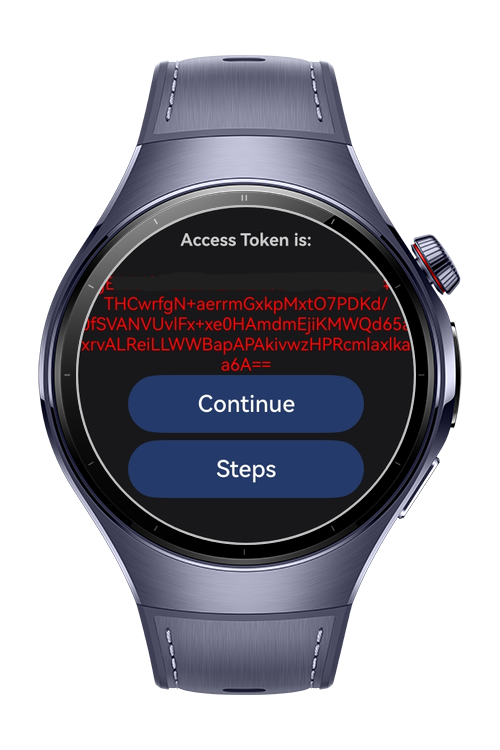
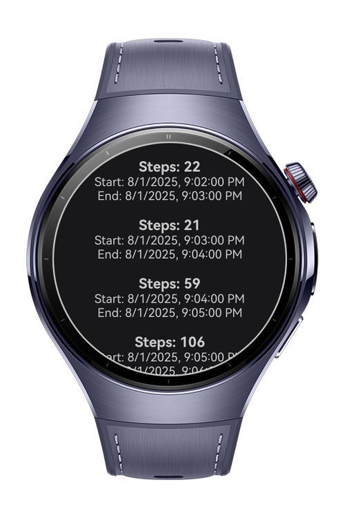

> **Note:** To access all shared projects, get information about environment setup, and view other guides, please visit [Explore-In-HMOS-Wearable Index](https://github.com/Explore-In-HMOS-Wearable/hmos-index).

# Fitness Health Kit App with Health Kit
This project demonstrates an application that runs with HarmonyOS Next wearable devices. This wearable project integrates with Health Kit to provide health data.

# Preview

<div>




</div>

# Use Cases

This wearable project integrates with Health Kit to provide health data. Upon starting the app, the app starts with a splash screen, followed by a screen that displays a QR code with the message "Install iFit on your mobile." Although the QR code is a placeholder for visual, clicking it redirects the user to the authentication page. After logging in with their Huawei ID, users are granted an access token, which is displayed on the screen. Two buttons are presented: "Steps" and "Continue." If the user selects "Steps," their step count, fetched from the Huawei Health API, is displayed. Clicking "Continue" brings up three additional options: "Exercises," "Heart Rate," and "Timer."

This project aims to provide users with a seamless, real-time health and fitness tracking experience, integrating various APIs and wearable device sensors.

- **Splash Page**: App icon and app name be shown on the screen and directly goes to QRPage.
- **QR Page**: By scanning the QR code on this page, the user can download the mobile version of this application, but this QR code is used only for visual purposes in this project.When you click on the QR, you are directed to the authentication page.
- **Authentication Page**: The user can login with your huawei id. After login, access token can obtain.
- **Steps Page**: The user can see the steps,start time, end time coming from Huawei Health.
- **Exercises Page**: Some exercise images be shown coming from wger api(https://wger.de/en/software/api).
- **Heart Rate Page**: The user can see the real-time heart rate with body sensor.
- **Timer Page**: The user can adjust the timer settings with fast and slow intervals. 1 round = 1 fast + 1 slow

# Technology
## Stack

- **Languages**: ArkTS
- **Libraries**: @kit.ArkUI, @kit.RemoteCommunicationKit, @kit.ArkWeb, @kit.NetworkKit,@kit.BasicServicesKit,  @kit.SensorServiceKit
  +Health Cloud

## Required Permissions
- ohos.permission.INTERNET
- ohos.permission.READ_HEALTH_DATA

# Directory Structure

   ```
entry/src/main/ets/
|---common
|---|---Constants
|---|---Preferences
|---|---processRespTask
|---component
|---|---ButtonComponent
|---|---ExerciseCardComponent
|---|---TimerButtonComponent
|---model
|---|---ExerciseModel
|---|---INavParams
|---|---PolymerizeWithItem
|---|---RSPModel
|---|---SamplePoint
|---|---SampleSet
|---|---StepDataResult
|---|---StepGroup
|---|---StepResponse
|---|---StepValue
|---|---TokenResponse
|---pages
|---|---AuthenticationPage
|---|---ExercisesPage
|---|---HeartRatePage
|---|---HomePage
|---|---Index
|---|---PrepareRound
|---|---QRPage
|---|---StepsPage
|---|---Timer
|---utils
|---|---RCP
|---|---RCPConstants
|---|---TimerConstants
|---viewmodel
|---|---AuthenticationViewModel
|---|---ExerciseViewModel
|---|---HeartRateViewModel
|---|---RoundViewModel
|---|---StepsViewModel
|---|---TimerService
|---entryability
|---|---EntryAbility
|---entrybackupability
|---|---EntryBackupAbility
   ```

# Constraints and Restrictions

## Supported Devices
- Huawei Watch 5

# License

**Fitness Health Kit** is distributed under the terms of the MIT License
See the [LICENSE](./LICENSE) for more information.
